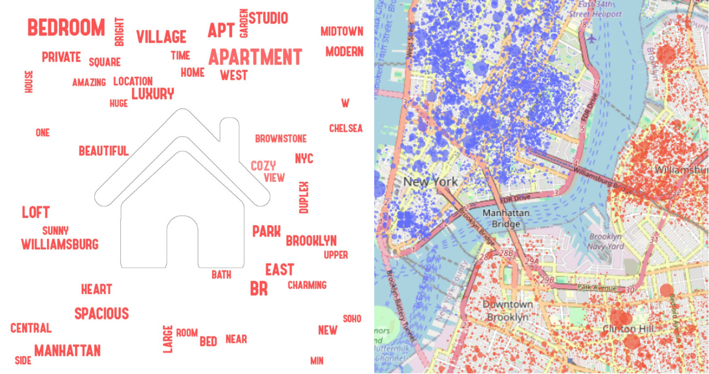

# 🗽 Vamos dar um breve passeio em NY? 

## Um trabalho de modelagem de predição de imóveis



Este repositório contém minha solução para o desafio técnico da trilha de Ciência de Dados do **Programa LightHouse**, uma iniciativa da empresa [Indicium](https://www.indicium.tech/pt-br/sobre-nos/quem-somos). O desafio faz parte do processo de admissão da edição **2025.3**.

## 🏡 Sobre o Desafio

O objetivo deste desafio é avaliar o candidato em sua capacidade de:
- Resolver problemas de negócio
- Análise de dados
- Aplicação de modelos preditivos


🎥 **Apresentação do Projeto:**
Assista a um vídeo curto onde apresento o desenvolvimento deste projeto: [Google Drive](https://drive.google.com/file/d/1M790CgENj_9nMsdEgX1oMKDiwbBlMg-m/view?usp=sharing).


## 🚀 Principais Tecnologias Utilizadas

- **Python** 🐍
- **Pandas, NumPy** (Manipulação de dados)
- **Matplotlib, Seaborn, WordCloud** (Visualização)
- **Scikit-learn** (Modelagem Preditiva)
- **Jupyter Notebook** (Ambiente de Desenvolvimento)

## 📂 Estrutura do Repositório

```
📦 indicium-lighthouse
├── 📂 data/                     # Arquivos de dados
│   ├── teste_indicium_precificacao.csv # Conjunto de dados fornecido
│   ├── exemplo_pred_precificacao.csv  # Exemplo de dados novos para predição
├── 📂 notebooks/                # Notebooks principais
│   ├── Projeto Lighthouse.ipynb # EDA e Modelagem
├── 📂 images/                   # Imagens utilizadas
│   ├── imoveis_thumbnail.png   # Capa do projeto
│   ├── home_blue.png           # Usado na análise
│   ├── home_red.png            # Usado na análise
├── 📂 models/                   # Modelos treinados
│   ├── modelo_ridge_treinado.pkl
├── 📂 fonts/                    # Fonte utilizada na nuvem de palavras
├── requirements.txt             # Lista de pacotes necessários
├── README.md                    # Você está aqui! 😃
```

## 📌 Como Executar o Projeto

1. Clone este repositório:
   ```bash
   git clone https://github.com/jorgeluizfigueira/indicium-lighthouse.git
   cd indicium-lighthouse
   ```
2. Instale as dependências:
   ```bash
   pip install -r requirements.txt
   ```
3. Abra os notebooks no Jupyter Notebook, Google Colab ou Kaggle.

## 🎯 Resultados

Esse projeto foi um verdadeiro exercício prático de como a ciência de dados pode ser aplicada para resolver problemas reais de negócios, como a precificação de imóveis. A análise exploratória e a modelagem nos permitiram identificar padrões e criar um modelo robusto para prever preços.

O modelo final treinado foi salvo como **modelo_ridge_treinado.pkl** e pode ser utilizado para novas predições.

## 👤 Sobre mim

Feito com 💙 por **Jorge Luiz Figueira**
- [LinkedIn](https://www.linkedin.com/in/jorgeluizfigueira/)
- [GitHub](https://github.com/jorgeluizfigueira/)

**🚀 Bora explorar NY juntos?** 🏙️

Se tiver alguma dúvida ou sugestão, me manda uma mensagem! 😉
